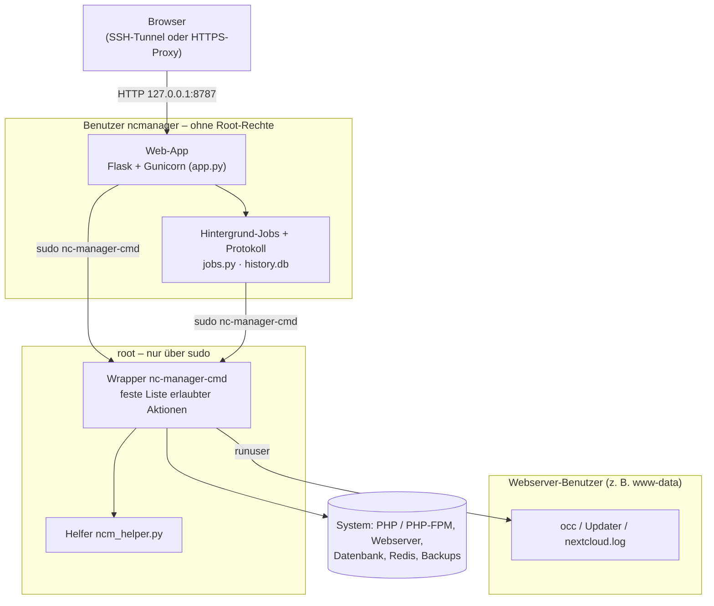

# Nextcloud Server Manager – Programmdokumentation (Version 0.7.1)

Stand: 2. Oktober 2026 · Die PDF-Fassung liegt jedem Release bei.

Der Nextcloud Server Manager (Version 0.7.1) ist eine Weboberfläche, mit der man eine selbst betriebene Nextcloud auf Debian, Ubuntu oder DietPi überwacht, wartet, sichert und aktualisiert – alle Aktionen an einer Stelle und mit Protokoll.

> **Urheber:** roswitina@hotmail.com · **Lizenz:** MIT · Unentgeltlich und ohne jede Gewährleistung bereitgestellt; die Nutzung erfolgt auf eigenes Risiko. Einzelheiten im Abschnitt „Lizenz und Haftungsausschluss“.

## Inhalt

- [Funktionsumfang](#funktionsumfang)
- [Architektur](#architektur)
- [Systemvoraussetzungen](#systemvoraussetzungen)
- [Installation](#installation)
- [Upgrade von älteren Versionen](#upgrade-von-älteren-versionen)
- [Zugriff](#zugriff)
- [Anmeldung und Sitzung](#anmeldung-und-sitzung)
- [Bedienung: Dashboard und Prüfungen](#bedienung-dashboard-und-prüfungen)
- [Bedienung: PHP und PHP-FPM](#bedienung-php-und-php-fpm)
- [Bedienung: Webserver](#bedienung-webserver)
- [Bedienung: Apps und Nextcloud-Update](#bedienung-apps-und-nextcloud-update)
- [Bedienung: Backups und Wiederherstellung](#bedienung-backups-und-wiederherstellung)
- [Bedienung: Diagnose](#bedienung-diagnose)
- [Bedienung: Wartung, Logs und Protokoll](#bedienung-wartung-logs-und-protokoll)
- [Hintergrund-Jobs und Sperre](#hintergrund-jobs-und-sperre)
- [Konfiguration](#konfiguration)
- [Dateien und Verzeichnisse](#dateien-und-verzeichnisse)
- [Sicherheitskonzept](#sicherheitskonzept)
- [Fehlerbehebung](#fehlerbehebung)
- [Deinstallation](#deinstallation)
- [Entwicklung und Tests](#entwicklung-und-tests)
- [Grenzen des Programms](#grenzen-des-programms)
- [Lizenz und Haftungsausschluss](#lizenz-und-haftungsausschluss)
- [Versionshistorie](#versionshistorie)

## Funktionsumfang

Das Programm bündelt die häufigsten Admin-Aufgaben einer Nextcloud-Instanz in zwölf Seiten. Alles, was etwas verändert, läuft als protokollierter Hintergrund-Job; es kann immer nur eine ändernde Aktion gleichzeitig laufen.

| Seite | Wofür | Ändert etwas? |
| --- | --- | --- |
| Dashboard | Zustand von Nextcloud, System, PHP, Datenbank, Webserver, Speicher, Hintergrundjobs; Ampel „Gesundheitszustand“ | nein |
| Prüfungen | Ergebnis von occ setupchecks – dieselben Hinweise wie die Nextcloud-Verwaltungsübersicht | nein |
| PHP | Wirksame PHP-Werte (inkl. .user.ini/.htaccess), Empfehlungen mit Quelle, Fundstellen in den INI-Dateien, Werte setzen | ja |
| PHP-FPM | Prozess-Pool, Speicher je Worker, Treffer „max\_children erreicht“, berechneter Vorschlag | ja |
| Webserver | Apache- bzw. nginx-Einstellungen für Nextcloud mit Empfehlung und Doku-Link, Vorschläge zum Kopieren; Apache-Module einschalten, Webserver testen und neu laden | nur Module und Neuladen |
| Apps | Verfügbare App-Updates, einzeln oder alle installieren, Liste aller Apps | ja |
| Update | Vorprüfung, Update-Suche, Nextcloud-Update mit optionalem Backup und App-Updates | ja |
| Backups | Backup mit Prüfsummen, optional mit Benutzerdaten; prüfen; geführte Wiederherstellung | ja |
| Diagnose | Datenbank, Redis und Hintergrundjobs mit konkreten Hinweisen | nein |
| Wartung | Repair, DB-Indizes/-Spalten/-Schlüssel, BigInt, Dateien einlesen, Aufräumen, Wartungsmodus | ja |
| Logs | nextcloud.log mit Filter und „nur neue Einträge“, archivieren und leeren, Rotation und Log-Level; PHP-FPM- und Webserver-Fehlerlog | ja |
| Protokoll | Die letzten 500 ausgeführten Aktionen mit Ausgabe und Exit-Code | nein |

Nicht enthalten sind Benutzerverwaltung und Benachrichtigungen per Mail oder Push (geplant). Mit Hooks lassen sich eigene Skripte vor und nach Updates sowie nach Backups einhängen.

## Architektur



Die Web-App läuft ohne Root-Rechte und darf per sudo nur den Wrapper aufrufen; Nextcloud selbst wird ausschließlich als Webserver-Benutzer angesprochen.

## Systemvoraussetzungen

Benötigt wird ein apt-basiertes Linux mit einer bereits laufenden Nextcloud und root-Zugang für die Installation.

| Bereich | Voraussetzung | Hinweis |
| --- | --- | --- |
| Betriebssystem | Debian 11 oder neuer, Ubuntu 22.04 oder neuer, DietPi | Der Installer bricht ohne apt-get ab |
| Python | Python 3.9 oder neuer | Wird vom Installer installiert (python3, python3-venv) |
| Nextcloud | Installiert, occ unter /var/www/nextcloud, /var/www/html/nextcloud oder /opt/nextcloud (sonst Pfad eingeben) | Prüfungen-Seite erst ab Nextcloud 28 (occ setupchecks) |
| PHP | PHP-CLI im PATH; Web per PHP-FPM oder Apache mit mod\_php | Pfade nach Debian-Schema /etc/php/\<Version>/{cli,fpm,apache2} |
| Webserver-Benutzer | www-data (sonst fragt der Installer) | Unter diesem Benutzer laufen alle occ-Befehle |
| Datenbank-Werkzeuge | mariadb-dump und mariadb bzw. pg\_dump und psql für Backup und Wiederherstellung; optional redis-cli (Paket redis-tools) für die Redis-Diagnose | Installiert der Installer automatisch, wenn MariaDB/MySQL bzw. PostgreSQL läuft; SQLite braucht nichts |
| Weitere Pakete | sudo, util-linux (flock, runuser), tar, gzip | sudo und util-linux installiert der Installer |
| Speicher | ca. 60 MB für Programm und venv; für Backups mindestens Größe des Programmcodes + 1 GB frei | Auf dem Raspberry Pi Backups besser auf USB-Laufwerk statt SD-Karte |
| Browser | Aktueller Browser mit JavaScript | Ohne JavaScript funktioniert alles außer Live-Ausgabe und Rückfragen |

Zugriff aufs Internet braucht der Server nur für die Paketinstallation, die Update-Suche und die App-Update-Prüfung (App Store).

## Installation

Die Installation dauert etwa zwei bis fünf Minuten und läuft komplett über das Skript install.sh, das als root gestartet wird.

1. Archiv auf den Server kopieren, z. B. mit `scp nc-manager-v0.7.1.tar.gz user@server:`
2. Entpacken und ins Verzeichnis wechseln:

   ```bash
   tar xzf nc-manager-v0.7.1.tar.gz
   cd nc-manager-v0.7.1
   ```
3. Installer starten: `sudo ./install.sh`
4. Die Fragen beantworten (Tabelle unten). Mit Enter wird jeweils die Vorgabe in eckigen Klammern übernommen.
5. Am Ende zeigt der Installer die Adresse der Oberfläche und – bei „nur localhost“ – den passenden SSH-Tunnel-Befehl.
6. Kontrolle: `systemctl status nc-manager` muss „active (running)“ zeigen.

### Fragen des Installers

| Frage | Vorgabe | Bedeutung |
| --- | --- | --- |
| Nextcloud-Pfad | automatisch erkannt | Nur gefragt, wenn occ in keinem der Standardpfade liegt |
| Webserver-Benutzer | www-data | Nur gefragt, wenn www-data nicht existiert |
| Zugriff 1) nur localhost 2) LAN | 1 (bei Upgrade: bisherige Einstellung) | 1 = nur über SSH-Tunnel oder Reverse-Proxy erreichbar (empfohlen); 2 = im ganzen Netz über unverschlüsseltes HTTP |
| Port | 8787 | TCP-Port der Oberfläche |
| HTTPS-Reverse-Proxy davor? | n | j setzt Secure-Cookies und wertet X-Forwarded-Header aus – nur mit Proxy wählen |
| Admin-Benutzer | admin | Benutzername für die Anmeldung (Buchstaben, Ziffern, . \_ @ -) |
| Backup-Verzeichnis | /var/backups/nc-manager | Ziel der Backups; auf dem Pi am besten ein USB-Laufwerk |
| Anzahl aufzubewahrender Backups | 3 | Ältere Backups werden nach jedem neuen Backup gelöscht |
| Nextcloud-Datenverzeichnis | aus config.php | Wird automatisch aus config.php gelesen und festgehalten; nur gefragt, wenn dort keins steht. Bei einem Upgrade mit geändertem Pfad zeigt der Installer alten und neuen Pfad und übernimmt den neuen nur nach Bestätigung mit j |
| Bestehendes Passwort beibehalten? | J | Nur bei Upgrade; sonst neues Passwort, mindestens 12 Zeichen, zweimal einzugeben |
| Lizenz und Haftungsausschluss akzeptieren? | N | Wird als Erstes gefragt; ohne j bricht der Installer ab, ohne etwas zu verändern. Unbeaufsichtigte Installation: NCM\_ACCEPT\_LICENSE=ja setzen. |

### Was der Installer tut

- Installiert python3, python3-venv, sudo und util-linux, bei Bedarf mariadb-client bzw. postgresql-client (für Backup und Wiederherstellung).
- Legt den Systembenutzer `ncmanager` ohne Login-Shell an.
- Kopiert die Web-App nach /opt/nc-manager und richtet dort eine Python-Umgebung (venv) mit Flask und Gunicorn ein.
- Installiert den Wrapper /usr/local/sbin/nc-manager-cmd und den Helfer /usr/local/lib/nc-manager/ncm\_helper.py, beide root-eigen, und legt den Hook-Ordner /etc/nc-manager/hooks an.
- Liest das Datenverzeichnis aus config.php (als Webserver-Benutzer) und hält es als NCM\_DATADIR fest. Der Wrapper vertraut später nur diesem Wert, nicht config.php (Abschnitt Sicherheitskonzept).
- Schreibt /etc/nc-manager.env (Rechte 600), die sudo-Regel /etc/sudoers.d/ncmanager (geprüft mit visudo) und den Dienst nc-manager.service.
- Aktiviert und startet den Dienst; startet er nicht, bricht der Installer mit Exit-Code 70 und der Statusausgabe ab.
- **Self-Test:** prüft Wrapper und occ, die Dashboard-Daten und die Login-Seite. Bei Problemen erscheint eine Warnung mit Details.

Das Passwort wird über stdin an Python übergeben und als scrypt-Hash gespeichert; es erscheint nie in der Prozessliste oder im Klartext auf der Platte.

## Upgrade von älteren Versionen

Ein Upgrade ist dieselbe Prozedur wie die Installation: neues Archiv entpacken und `sudo ./install.sh` ausführen. Der Installer erkennt die bestehende Installation und schlägt alle bisherigen Einstellungen als Vorgabe vor.

- **Übernommen** werden Benutzername, Passwort-Hash, Secret (bestehende Sitzungen bleiben gültig), Bind-Adresse, Port, Proxy-Einstellung, Backup-Verzeichnis, Aufbewahrungszahl und das festgehaltene Datenverzeichnis.
- **Ersetzt** werden app.py, jobs.py, templates/, static/, Wrapper und Helfer. Die venv bleibt erhalten, Pakete werden nur aktualisiert.
- **Protokoll:** Beim ersten Start migriert die App die alte Tabelle aus v0.4.3 automatisch. Reine Lese-Aufrufe wie Dashboard-Abfragen werden dabei verworfen, echte Aktionen bleiben erhalten.
- **Laufende Aktion:** Der Dienst wird während des Upgrades gestoppt. Ein laufender Hintergrund-Job (z. B. ein Nextcloud-Update) läuft dank KillMode=process trotzdem zu Ende. Besser ist es aber, das Upgrade erst danach zu starten.

**Von 0.7.0 auf 0.7.1:** Keine Besonderheiten. Behebt den Abbruch von Backup und Wiederherstellung (Exit-Code 38) bei Datenverzeichnissen mit `.ncdata`.

**Von 0.6.5 auf 0.7.0:** Keine Besonderheiten, einfach install.sh ausführen. Die neue Seite „Webserver“ steht danach sofort zur Verfügung.

**Von 0.6.4 auf 0.6.5:** Keine Besonderheiten, einfach install.sh ausführen.

**Von 0.6.3 auf 0.6.4:** Der Installer hält dabei erstmals das Datenverzeichnis fest. Bis install.sh ausgeführt wurde, lehnen Backup und Wiederherstellung mit dem Hinweis „install.sh erneut ausführen“ ab (Exit-Code 38 bzw. 67). Wer das Datenverzeichnis später verschiebt, führt install.sh danach erneut aus.

Von v0.4.x auf v0.5.x fragt der Installer zusätzlich nach Backup-Verzeichnis und Anzahl der Backups. Backups aus Versionen vor 0.6.1 haben keine Prüfsummen; sie lassen sich weiter prüfen und wiederherstellen, geprüft wird dann nur ihre Struktur. Neue Passwörter müssen seit v0.4.4 mindestens 12 Zeichen haben; ein beibehaltenes kürzeres Passwort funktioniert weiter.

## Zugriff

Empfohlen ist „nur localhost“ plus SSH-Tunnel oder HTTPS-Reverse-Proxy, weil die Oberfläche Root-Aktionen auslöst und selbst kein TLS spricht.

| Variante | Sicherheit | Aufwand | Wann sinnvoll |
| --- | --- | --- | --- |
| SSH-Tunnel | verschlüsselt, nur für SSH-Benutzer erreichbar | keiner | Einzelner Admin mit SSH-Zugang |
| HTTPS-Reverse-Proxy | verschlüsselt, zusätzlich absicherbar (IP-Filter, Basic Auth) | gering | Zugriff vom Handy oder ohne SSH |
| LAN (Option 2) | unverschlüsselt, Passwort im Klartext im Netz | keiner | Nur in einem vertrauenswürdigen Heimnetz |

Die Oberfläche muss unter dem Wurzelpfad / einer eigenen (Sub-)Domain laufen; ein Unterpfad wie /manager wird nicht unterstützt.

### SSH-Tunnel

Auf dem eigenen Rechner ausführen und das Fenster offen lassen, dann im Browser http://localhost:8787 öffnen:

```bash
ssh -L 8787:127.0.0.1:8787 benutzer@server
```

Unter Windows geht das genauso in der PowerShell (OpenSSH ist eingebaut) oder in PuTTY unter Connection → SSH → Tunnels.

### HTTPS-Reverse-Proxy mit nginx

Im Installer die Proxy-Frage mit j beantworten. Beispiel für einen eigenen server-Block (Zertifikat z. B. von Let's Encrypt):

```nginx
server {
    listen 443 ssl;
    server_name manager.example.lan;
    ssl_certificate     /etc/letsencrypt/live/manager.example.lan/fullchain.pem;
    ssl_certificate_key /etc/letsencrypt/live/manager.example.lan/privkey.pem;

    # optional: nur aus dem Heimnetz
    # allow 192.168.0.0/16; deny all;

    location / {
        proxy_pass http://127.0.0.1:8787;
        proxy_set_header Host $host;
        proxy_set_header X-Forwarded-For $remote_addr;
        proxy_set_header X-Forwarded-Proto $scheme;
        proxy_read_timeout 300s;
    }
}
```

Danach `nginx -t && systemctl reload nginx`.

### HTTPS-Reverse-Proxy mit Apache

Module aktivieren: `a2enmod proxy proxy_http headers ssl`. Dann ein VirtualHost wie dieser:

```apache
<VirtualHost *:443>
    ServerName manager.example.lan
    SSLEngine on
    SSLCertificateFile    /etc/letsencrypt/live/manager.example.lan/fullchain.pem
    SSLCertificateKeyFile /etc/letsencrypt/live/manager.example.lan/privkey.pem

    ProxyPreserveHost On
    ProxyPass        / http://127.0.0.1:8787/
    ProxyPassReverse / http://127.0.0.1:8787/
    RequestHeader set X-Forwarded-Proto "https"
    ProxyTimeout 300
</VirtualHost>
```

Danach `apachectl configtest && systemctl reload apache2`.

Wichtig: Mit Proxy-Einstellung j vertraut die App genau einem vorgeschalteten Proxy bei der Client-IP. Der Port 8787 darf dann nicht zusätzlich direkt erreichbar sein – also Zugriff „nur localhost“ wählen.

### LAN

Option 2 bindet an 0.0.0.0. Die Oberfläche ist dann unter http://\<Server-IP>:8787 erreichbar. Eine eventuell aktive Firewall (ufw) muss den Port freigeben: `ufw allow from 192.168.0.0/16 to any port 8787 proto tcp`.

## Anmeldung und Sitzung

Es gibt genau einen Benutzer, der beim Installieren festgelegt wird. Nach fünf Fehlversuchen innerhalb von 15 Minuten sperrt die App die betreffende IP-Adresse für 15 Minuten.

- **Sitzungsdauer:** Nach 2 Stunden ohne Aktivität ist man abgemeldet. Jeder Seitenaufruf verlängert die Sitzung.
- **Abmelden:** Roter Button oben rechts. Er löscht die Sitzung sofort.
- **Formulare** tragen ein CSRF-Token. Nach Ablauf der Sitzung erscheint „Sitzung abgelaufen“ – Seite neu laden und erneut anmelden.
- **Fehlversuche** stehen mit IP-Adresse im Journal: `journalctl -u nc-manager | grep Anmeldung`.

### Passwort oder Benutzer ändern

Am einfachsten den Installer erneut ausführen und „Bestehendes Passwort beibehalten?“ mit n beantworten. Ohne Installer geht es so:

```bash
sudo /opt/nc-manager/venv/bin/python -c 'import getpass; from werkzeug.security import generate_password_hash as g; print(g(getpass.getpass("Neues Passwort: ")))'
# Ausgabe kopieren und in /etc/nc-manager.env bei NCM_PASSWORD_HASH= eintragen
sudo nano /etc/nc-manager.env
sudo systemctl restart nc-manager
```

### Sperre vorzeitig aufheben

```bash
sudo -u ncmanager /opt/nc-manager/venv/bin/python -c 'import sqlite3; c=sqlite3.connect("/var/lib/nc-manager/history.db"); c.execute("DELETE FROM login_fail"); c.commit()'
```

### Alle Sitzungen beenden

NCM\_SECRET in /etc/nc-manager.env durch einen neuen Wert ersetzen (z. B. Ausgabe von `openssl rand -hex 32`) und den Dienst neu starten. Alle bestehenden Sitzungs-Cookies werden damit ungültig.

## Bedienung: Dashboard und Prüfungen

Das Dashboard ist die Startseite und zeigt in einem Blick, ob die Instanz betriebsbereit ist. Es liest nur und lädt in ein bis drei Sekunden (auf dem Pi etwas länger), weil es Nextcloud nur zweimal per occ startet.

### Karten des Dashboards

| Karte | Inhalt |
| --- | --- |
| Kopfzeile | Nextcloud-Version, Installationspfad, Status „Betriebsbereit“ oder „Prüfen“ (Wartungsmodus an oder DB-Upgrade offen) |
| Betrieb | Zusammenfassung der Prüfungen, Zahl der App-Updates, Alter des letzten Backups, ob das PHP-FPM-Limit erreicht wurde |
| Nextcloud | Version, Wartungsmodus, DB-Upgrade, Installations- und Datenverzeichnis, verwendetes CLI (occ oder ncc) |
| System | Betriebssystem, DietPi ja/nein, Kernel, Architektur, Uptime, RAM, Root-Dateisystem |
| PHP / Plattform | CLI-Version und php.ini, Web-SAPI (FPM oder mod\_php), FPM-Dienst, FPM memory\_limit und upload\_max\_filesize, DietPi-INI |
| Datenbank & Cache | DB-Typ, -Host, -Name, MariaDB- und Redis-Dienst, memcache.local und memcache.locking aus config.php |
| Webserver & Jobs | Apache/nginx, Modus der Hintergrundjobs (cron/ajax/webcron) und Zeit des letzten Laufs |
| Storage | Datenverzeichnis und Belegung des Dateisystems |
| Gesundheitszustand | Ampel aus bis zu acht Prüfpunkten (siehe unten) |

Die Ampel prüft: Nextcloud erreichbar, Wartungsmodus aus, kein DB-Upgrade offen, PHP-FPM aktiv, Redis aktiv, Hintergrundjobs laufen (letzter Cron-Lauf jünger als 1 Stunde), PHP-FPM-Limit nicht erreicht und – sobald geprüft – keine Fehler in den Nextcloud-Prüfungen. Ein ⚠ bei Redis ist harmlos, wenn bewusst kein Redis verwendet wird.

Passwörter, Secrets und Tokens aus config.php werden nie abgefragt oder angezeigt.

### Prüfungen

Die Seite zeigt das Ergebnis von `occ setupchecks`, also dieselben Hinweise wie Verwaltung → Übersicht in Nextcloud (ab Version 28). Sortiert wird nach Schwere: Fehler, Warnung, Hinweis; bestandene Prüfungen sind eingeklappt. Wo Nextcloud einen Dokumentationslink liefert, steht er unter dem Eintrag.

- Die Prüfung dauert je nach Instanz 5 bis 60 Sekunden, weil Nextcloud dabei auch Anfragen an sich selbst stellt.
- Das Ergebnis wird gespeichert. „Neu prüfen“ führt die Prüfung erneut aus.
- Nach jeder ändernden Aktion (außer Backups und Update-Suche) verwirft die App das gespeicherte Ergebnis; beim nächsten Aufruf wird neu geprüft.
- Vor Nextcloud 28 erscheint der Hinweis „occ setupchecks gibt es erst ab Nextcloud 28“.

## Bedienung: PHP und PHP-FPM

PHP-Einstellungen schreibt der Manager ausschließlich in eigene Dateien; die Dateien von Debian, Ubuntu und DietPi bleiben unverändert. Jede Änderung wird vor dem Neuladen geprüft und bei Fehlern zurückgerollt.

### Seite PHP

Oben stehen Distribution, CLI- und Web-SAPI sowie die geladenen php.ini-Dateien. Die Tabelle „Effektive PHP-Werte“ vergleicht 19 Einstellungen zwischen CLI (gilt für occ und Cron) und PHP-FPM (gilt für den Webzugriff); ≠ markiert Abweichungen. Darunter folgt, in welcher Reihenfolge die INI-Dateien geladen werden – die zuletzt geladene gewinnt.

Im Bereich „PHP-Werte ändern“ steht für jede änderbare Einstellung der Wert, den Webanfragen tatsächlich bekommen (mit seiner Herkunft), die Empfehlung, deren Grundlage mit Link zur Nextcloud-Dokumentation und eine Bewertung. Zu niedrige Werte lassen sich mit „Empfehlung setzen“ übernehmen; höhere Werte werden nie herabgesetzt. Das Formular „Eigenen Wert setzen“ ist mit dem aktuellen Wert vorausgefüllt.

| Einstellung | Empfehlung | Grundlage | Erlaubtes Format |
| --- | --- | --- | --- |
| memory\_limit | 512M | Doku: „mindestens 512MB“ | Zahl mit K/M/G, -1 = unbegrenzt |
| upload\_max\_filesize | 16G | Doku-Beispiel (große Dateien) | Zahl mit K/M/G |
| post\_max\_size | 16G | Doku-Beispiel; mindestens so groß wie upload\_max\_filesize | Zahl mit K/M/G |
| max\_execution\_time | 3600 | Doku-Beispiel | Sekunden, 0 = unbegrenzt |
| max\_input\_time | 3600 | Doku-Beispiel | Sekunden, -1 = wie max\_execution\_time |
| output\_buffering | 0 | Doku: muss aus sein | Zahl, 0 = aus |
| opcache.memory\_consumption | 128 | Richtwert: PHP-Standard | MB |
| opcache.interned\_strings\_buffer | 16 | Richtwert: PHP-Standard ist 8, 16 ist der übliche Wert gegen die Nextcloud-Warnung | MB |
| opcache.max\_accelerated\_files | 10000 | Richtwert: PHP-Standard | Anzahl Dateien |

Die Grundlage zeigt, wie verbindlich eine Empfehlung ist. **Doku** heißt, das [Nextcloud-Handbuch](https://docs.nextcloud.com/server/latest/admin_manual/installation/php_configuration.html) nennt den Wert ausdrücklich. **Doku-Beispiel** ist ein Beispielwert aus [Große Dateien hochladen](https://docs.nextcloud.com/server/latest/admin_manual/configuration_files/big_file_upload_configuration.html), den man an die eigenen Dateigrößen anpasst. **Richtwert** heißt, die Doku nennt keine Zahl; Nextcloud misst den OPcache-Füllstand selbst und warnt unter Prüfungen ([Server-Tuning](https://docs.nextcloud.com/server/latest/admin_manual/installation/server_tuning.html)). Ist post\_max\_size kleiner als upload\_max\_filesize, warnt die Seite.

Web-Oberfläche und Desktop-Client laden große Dateien in Teilstücken hoch; die Upload-Grenzen betreffen vor allem Programme ohne Teilstücke (z. B. manche WebDAV-Clients).

Beim Speichern passiert Folgendes:

1. Der Wert wird in `/etc/php/<Version>/cli/conf.d/99-nextcloud-manager.ini` und in die gleichnamige Datei jeder laufenden FPM-Version geschrieben (bei mod\_php in `apache2/conf.d`). Die vorherige Datei kommt nach `<Backup-Verzeichnis>/php/`.
2. `php-fpm<Version> -t` (bzw. `apache2ctl configtest`) prüft die Konfiguration. Bei Fehlern werden alle Dateien zurückgesetzt (Exit-Code 68).
3. Jede betroffene FPM-Version wird per `systemctl reload` neu geladen, bei mod\_php Apache.
4. Meldet die CLI danach einen anderen Wert, überschreibt eine später geladene Datei den Wert – die Ausgabe zeigt eine Warnung.

Hinweis: max\_execution\_time ist in der CLI immer 0; dort zeigt die Seite deshalb keinen Vergleich.

### Wo stehen die Werte?

Der Bereich listet für jede Einstellung alle Fundstellen in den tatsächlich geladenen INI-Dateien, getrennt nach CLI und FPM und in Ladereihenfolge. Die jeweils letzte ist als „wirksam“ markiert, frühere als „überschrieben“. So lässt sich schnell finden, welche Datei einen Wert festhält – etwa eine DietPi-Datei, die nach der Manager-Datei geladen wird.

### .user.ini und .htaccess von Nextcloud

Nextcloud liefert im Programmordner eine .user.ini (gilt für PHP-FPM) und eine .htaccess mit php\_value-Zeilen (gilt nur für Apache mit mod\_php). Was dort steht, gilt für Webanfragen vorrangig vor der PHP-Konfiguration – außer bei OPcache-Werten. Aktuelle Versionen setzen dort nur output\_buffering=0 und default\_charset; ältere setzten zusätzlich z. B. upload\_max\_filesize=511M.

- Die Spalte „Aktuell (Web)“ zeigt den wirksamen Wert und seine Herkunft, etwa „aus .user.ini (Konfiguration: 16G)“.
- Erzwingt die Datei einen schlechteren Wert als empfohlen, erscheint eine Warnung, und statt „Empfehlung setzen“ steht „in .user.ini festgelegt“.
- Der Manager ändert diese Dateien nicht, weil Nextcloud sie bei jedem Update ersetzt. Wer den Wert ändern will, passt die Zeile dort an oder entfernt sie – und muss das nach Updates wiederholen.
- Die Karte „Nextcloud-spezifische Dateien“ listet alle Werte aus beiden Dateien.

### Seite PHP-FPM

PHP-FPM hält eine begrenzte Zahl von PHP-Prozessen (Workern) bereit. Sind alle belegt, warten Besucher – Nextcloud wirkt dann zeitweise langsam oder hängt. Die Seite zeigt je laufender FPM-Version:

- RAM gesamt und verfügbar.
- Wie oft „server reached pm.max\_children“ in den letzten 20.000 Zeilen des FPM-Logs steht, mit dem letzten Treffer.
- Je Pool: die Pool-Dateien, die Zahl laufender Worker, Speicher je Worker (Durchschnitt, Maximum, Summe) und die aktuellen pm-Werte neben einem Vorschlag.

Der Speicher wird als PSS gemessen: Gemeinsam genutzter Speicher wie der OPcache wird anteilig gezählt statt bei jedem Worker voll. Der Vorschlag berechnet sich so:

> **max\_children = abgerundet( (0,85 × RAM gesamt − RAM anderer Dienste) ÷ RAM je Worker )**, mindestens 2, höchstens 120

- RAM je Worker = gemessener Durchschnitt, mindestens 64 MB; ohne laufende Worker werden 96 MB angenommen.
- RAM andere Dienste = belegter RAM abzüglich aller FPM-Worker (Datenbank, Redis, System …); 15 % bleiben als Reserve.
- Die Obergrenze 120 sorgt dafür, dass die Datenbankverbindungen reichen (MariaDB-Standard max\_connections = 151).
- Daraus folgen pm = dynamic, min\_spare = 15 %, start = 25 %, max\_spare = 35 % von max\_children und max\_requests = 500 (Worker werden nach 500 Anfragen erneuert, gegen Speicherlecks).

„Vorschlag übernehmen“ schreibt alle sechs Werte; unter „Eigene Werte setzen“ lassen sie sich einzeln ändern. Bei pm = dynamic muss gelten: 1 ≤ min\_spare ≤ start ≤ max\_spare ≤ max\_children – sonst lehnt der Manager die Änderung vorab ab.

Geschrieben wird nur `/etc/php/<Version>/fpm/pool.d/zzzz-nextcloud-manager.conf`. Der Name sorgt dafür, dass die Datei nach allen üblichen Pool-Dateien geladen wird und deren Werte überschreibt. Danach folgen `php-fpm -t` mit Rückrollen bei Fehlern und ein Reload. Laufen mehrere Pools oder PHP-Versionen, teilen sie sich das RAM-Budget – dann die Werte entsprechend aufteilen.

## Bedienung: Webserver

Die Seite Webserver prüft die Einstellungen von Apache bzw. nginx, die Nextcloud braucht – mit Empfehlung, Grundlage und Link zum passenden Abschnitt der Nextcloud-Doku. Sie liest die Konfiguration nur; geändert wird nichts, außer über die zwei Knöpfe unten.

### Wie die Seite prüft

- **Erkennung:** Geprüft wird jeder Webserver, der läuft (Apache und nginx auch gleichzeitig, z. B. nginx als Reverse-Proxy vor Apache). Läuft keiner, sagt die Seite das; ein Reverse-Proxy auf einem anderen Rechner lässt sich nicht prüfen.
- **Apache:** Der Wrapper liest apache2.conf samt allen Include-Dateien und ermittelt mit `apache2ctl -M` die geladenen Module. `<IfModule>`-Abschnitte zählen nur, wenn das Modul geladen ist. Steht z. B. der HSTS-Header in `<IfModule mod_headers.c>` und mod_headers fehlt, meldet die Seite „steht in …, wirkt aber nicht“.
- **nginx:** Der Wrapper wertet `nginx -T` aus (die vollständige geladene Konfiguration) und berücksichtigt die Vererbung von http- über server- bis zum PHP-location-Block.
- **Nextcloud-Bereich:** Gesucht wird der VirtualHost bzw. server-Block, dessen DocumentRoot/root das Nextcloud-Verzeichnis ist; bei Apache auch ein Alias (Nextcloud unter /nextcloud), bei nginx ein Unterverzeichnis. Gibt es mehrere, gilt der HTTPS-Bereich. Alle Bereiche lassen sich unter „Alle VirtualHosts / server-Blöcke“ aufklappen.
- An die Web-App gehen nur die ermittelten Werte, nicht die Konfigurationsdateien selbst.

### Prüfungen bei Apache

| Prüfung | Empfehlung | Bewertung |
| --- | --- | --- |
| mod\_rewrite | geladen | Pflicht (rot): ohne wirken Nextclouds .htaccess-Regeln nicht |
| mod\_headers, mod\_env, mod\_dir, mod\_mime | geladen | empfohlen (gelb); bei fehlendem Modul erscheint „Einschalten“ |
| mod\_setenvif | geladen | empfohlen bei PHP-FPM |
| AllowOverride für den Nextcloud-Ordner | All | rot, sonst ignoriert Apache die .htaccess. Ermittelt aus dem tiefsten passenden `<Directory>`-Abschnitt (Apache-Standard: None) |
| Dav off | aus | nur wenn mod\_dav geladen ist |
| HSTS | max-age ≥ 15552000 | nur im HTTPS-VirtualHost; 180 Tage verlangt auch die Nextcloud-Prüfung |
| Weiterleitungen /.well-known | aktiv | im Wurzelverzeichnis über Nextclouds .htaccess; bei Alias-Installation müssen eigene RewriteRules im Wurzel-VirtualHost stehen |
| Pretty URLs | htaccess.RewriteBase gesetzt | optional (Info) |
| LimitRequestBody, mod\_reqtimeout | – | zur Info: betreffen sehr große Uploads ohne Teilstücke |

### Prüfungen bei nginx

| Prüfung | Empfehlung | Bewertung |
| --- | --- | --- |
| client\_max\_body\_size | 512M (oder 0 = unbegrenzt) | rot unter 100 MB (nginx-Standard: 1 MB), gelb unter 512 MB |
| client\_body\_timeout | 300s | gelb darunter (Standard 60s) |
| fastcgi\_buffers | 64 4K | gelb, wenn nicht gesetzt |
| MIME-Typ .mjs / .wasm | text/javascript / application/wasm | .mjs rot, .wasm gelb |
| Weiterleitungen /.well-known | vorhanden | gelb – nginx liest keine .htaccess |
| Interne Ordner gesperrt | location-Regel für build, tests, config, lib, 3rdparty, templates, data | rot (Sicherheit) |
| Sicherheits-Header | Referrer-Policy, X-Content-Type-Options, X-Frame-Options, X-Permitted-Cross-Domain-Policies, X-Robots-Tag | gelb; Hinweis, wenn der PHP-Block eigene add\_header-Zeilen hat (dann gelten die des server-Blocks dort nicht) |
| HSTS | max-age ≥ 15552000 | wie bei Apache |
| front\_controller\_active | true | optional (Pretty URLs) |
| fastcgi\_hide\_header X-Powered-By | gesetzt | gelb |
| try\_files im PHP-Block | gesetzt | gelb – sonst gehen beliebige Pfade an PHP-FPM |
| gzip, server\_tokens | on, off | gelb |
| fastcgi\_read\_timeout, fastcgi\_request\_buffering | – | zur Info; die aktuelle Doku-Beispielkonfiguration setzt request\_buffering „on“ |

Die Grundlage jeder Empfehlung steht als Kennzeichen daneben: „Doku“ (ausdrücklich genannt) oder „Doku-Beispiel“ (Wert der Beispielkonfiguration, an eigene Bedürfnisse anpassbar).

### Vorschläge und Aktionen

- **Vorschlag:** Unter jeder Abweichung lässt sich aufklappen, welche Zeile(n) wohin gehören, z. B. „in den server-Block der Nextcloud (/etc/nginx/sites-enabled/nextcloud)“. Die Änderung trägt man selbst ein. Der Manager schreibt die Webserver-Konfiguration bewusst nicht: VirtualHosts und server-Blöcke sind sehr unterschiedlich aufgebaut, und ein Fehler dort macht die Nextcloud unerreichbar.
- **Einschalten** (nur Apache): schaltet ein fehlendes Modul aus der festen Liste rewrite, headers, env, dir, mime, setenvif mit `a2enmod` ein, testet die Konfiguration und lädt Apache neu. Scheitert der Test, wird das Modul wieder abgeschaltet (Exit-Code 68) und Apache läuft unverändert weiter.
- **Testen und neu laden:** prüft die Konfiguration (`apache2ctl configtest` bzw. `nginx -t`) und lädt den Webserver nur dann neu. Bei einem Fehler bleibt der laufende Webserver unverändert (Exit-Code 68), die Ausgabe nennt Datei und Zeile.

## Bedienung: Apps und Nextcloud-Update

App-Updates und das Nextcloud-Update laufen über die offiziellen Werkzeuge (occ app:update und updater.phar); der Manager führt sie nur geordnet und protokolliert aus.

### Seite Apps

- Die Seite fragt beim App Store ab, für welche Apps es neue Versionen gibt (`occ app:update --showonly`), und zeigt installierte und neue Version.
- Das Ergebnis wird gespeichert, weil die Abfrage einige Sekunden dauert. „Neu prüfen“ fragt erneut ab; nach jeder ändernden Aktion wird automatisch neu geprüft.
- „Aktualisieren“ installiert eine einzelne App, „Alle aktualisieren“ alle verfügbaren Updates (`occ app:update --all`). Beides läuft als Hintergrund-Job.
- Unter „Installierte Apps“ stehen alle aktivierten und deaktivierten Apps mit Version.

### Seite Update

Beim Aufruf läuft automatisch die Vorprüfung. Nur wenn sie erfolgreich ist, lässt sich das Update starten.

| Vorprüfung | Abbruch, wenn … | Exit-Code |
| --- | --- | --- |
| occ status | Nextcloud antwortet nicht | 10 |
| updater/updater.phar | Datei fehlt | 11 |
| Freier Speicher | weniger als die doppelte Größe des Programmcodes frei (Datenverzeichnis wird nicht mitgezählt) | 12 |
| Wartungsmodus | schon aktiv – nur Hinweis, kein Abbruch | – |
| Letztes Manager-Backup | nur Anzeige: Zeitpunkt, mit/ohne Benutzerdaten, Prüfstatus | – |
| Verfügbare App-Updates | nur Anzeige (höchstens 60 Sekunden Wartezeit auf den App Store) | – |

„Nach Update suchen“ führt `occ update:check` aus. Vor dem Start gibt es drei Optionen:

- **Vorher Backup erstellen** (vorausgewählt): vollständiges Manager-Backup, siehe nächster Abschnitt. Schlägt es fehl, startet das Update nicht (Exit-Code 19). Ohne diese Option wird nur config.php gesichert.
- **Danach alle App-Updates installieren.**
- **Benutzerdaten extern gesichert** (Pflicht): Bestätigung, dass ein Backup oder Snapshot des Datenverzeichnisses existiert.

Ablauf des Updates:

1. Sperre setzen; Hook pre-update ausführen, falls vorhanden (schlägt er fehl: kein Update, Exit-Code 18); Vorprüfung wiederholen.
2. Backup erstellen (Anlass „vor Nextcloud-Update“) bzw. config.php sichern.
3. Offiziellen Updater als Webserver-Benutzer ausführen (`updater.phar --no-interaction`). Er lädt die neue Version, schaltet den Wartungsmodus ein und führt in der Regel auch `occ upgrade` aus (Abbruch: Exit-Code 21).
4. Falls danach noch ein Datenbank-Upgrade aussteht: `occ upgrade` (Exit-Code 22).
5. `maintenance:repair`, fehlende DB-Indizes, -Spalten und Primary Keys ergänzen (Exit-Codes 23 bis 26).
6. Optional alle App-Updates; Fehler hier sind nur eine Warnung.
7. Abschlussstatus anzeigen, Hook post-update ausführen (Fehler nur als Warnung). Ist der Wartungsmodus noch aktiv, steht ein Hinweis in der Ausgabe – nach Prüfung unter Wartung ausschalten.

Der Updater springt pro Durchlauf höchstens eine Hauptversion weiter (z. B. 29 → 30). Für 28 → 30 also zweimal aktualisieren. Die Seite kann während des Updates geschlossen werden; die Ausgabe ist später im Protokoll.

## Bedienung: Backups und Wiederherstellung

Ein Manager-Backup macht ein misslungenes Update rückgängig: Es enthält Datenbank, Programmcode und config.php, auf Wunsch auch die Benutzerdaten. Jedes Backup trägt SHA-256-Prüfsummen, lässt sich jederzeit prüfen und über einen Assistenten wiederherstellen.

### Inhalt eines Backups

Jedes Backup liegt in einem eigenen Ordner `<Backup-Verzeichnis>/JJJJMMTT-HHMMSS/`, nur für root lesbar (Ordner 700, Dateien 600).

| Datei | Inhalt |
| --- | --- |
| database.sql.gz | Dump der Datenbank (MySQL/MariaDB mit --single-transaction, PostgreSQL mit pg\_dump), gzip-komprimiert |
| database.sqlite.gz | stattdessen bei SQLite: konsistente Kopie der .db-Datei |
| nextcloud-code.tar.gz | Programmverzeichnis ohne Datenverzeichnis |
| nextcloud-data.tar.gz | nur im Vollbackup: das komplette Datenverzeichnis |
| config.php | Kopie der Konfiguration (enthält Zugangsdaten) |
| info.json | Nextcloud-Version, Pfade, DB-Typ, Anlass, Kennzeichen „mit Benutzerdaten“ |
| checksums.sha256 | SHA-256-Prüfsummen aller Dateien, beim Erstellen geschrieben |
| verify.json | Ergebnis der letzten Prüfung (entsteht beim Prüfen) |
| WIEDERHERSTELLEN.txt | Anleitung für die Wiederherstellung von Hand |

Vor jedem Backup prüft der Manager, ob im Ziel genug Platz frei ist: Programmcode, gegebenenfalls Datenverzeichnis, plus 1 GB (sonst Exit-Code 30). Nach jedem erfolgreichen Backup werden die ältesten gelöscht, bis NCM\_BACKUP\_KEEP (Standard 3) übrig sind; ein Backup, das gerade wiederhergestellt wird, bleibt dabei immer erhalten.

### Normales Backup und Vollbackup

- **Normales Backup** (Standard, auch vor Updates): Datenbank, Code und config.php. Der Dump läuft im laufenden Betrieb und blockiert Nextcloud nicht.
- **Vollbackup** (Häkchen „Benutzerdaten mitsichern“): zusätzlich das Datenverzeichnis. Nextcloud ist dabei im Wartungsmodus, damit Datenbank und Dateien zum selben Zeitpunkt gehören. Der Wartungsmodus wird danach – auch bei einem Abbruch – wieder ausgeschaltet. Ändert sich während des Sicherns eine einzelne Datei, erscheint nur ein Hinweis.

Ein Vollbackup ersetzt kein externes Backup: Es liegt auf demselben Server. Mit dem Hook post-backup lässt es sich automatisch auf ein NAS kopieren (Abschnitt Konfiguration).

### Seite Backups

Die Liste zeigt je Backup Zeitpunkt, Nextcloud-Version, Größe, Anlass, „mit/ohne Benutzerdaten“ und den Prüfstatus (geprüft vor … / Prüfung fehlgeschlagen / nicht geprüft).

- **Prüfen** läuft als Hintergrund-Job, weil es alle Archive vollständig liest. Geprüft werden: die Prüfsummen, config.php, der Datenbank-Dump (vollständig entpackt, Abschlusszeile vorhanden – erkennt abgeschnittene Dumps; bei SQLite `integrity_check`), das Code-Archiv (vollständig lesbar, enthält occ und version.php) und gegebenenfalls das Daten-Archiv.
- **Wiederherstellen …** öffnet den Assistenten (nächster Abschnitt).
- **Löschen** entfernt ein Backup nach Rückfrage endgültig.

### Wiederherstellung mit dem Assistenten

Der Assistent zeigt zuerst, was passieren wird und ob etwas dagegen spricht. Gestartet wird erst nach Eingabe von WIEDERHERSTELLEN.

1. Backup vollständig prüfen. Bei Fehlern: Abbruch, nichts wird verändert.
2. Prüfen, ob das Backup zu dieser Installation gehört (Programm- und Datenpfad), ob das Datenverzeichnis vertrauenswürdig ist (siehe Sicherheitskonzept) und genug Platz frei ist.
3. Sicherheits-Backup des aktuellen Stands (Datenbank + Code). Es erscheint danach in der Backup-Liste.
4. Programmcode in einen temporären Ordner entpacken, Wartungsmodus einschalten.
5. Nur bei Vollbackups: bisheriges Datenverzeichnis umbenennen, Benutzerdaten entpacken.
6. Datenbank zurückspielen – bei MySQL/MariaDB werden vorher alle Tabellen gelöscht, damit keine nach dem Backup entstandenen Tabellen übrig bleiben (sonst scheitert das nächste Upgrade). PostgreSQL läuft in einer Transaktion. Scheitert der Import, spielt der Assistent automatisch das Sicherheits-Backup ein.
7. Programmcode austauschen (bisheriger Ordner wird umbenannt), data-fingerprint, Wartungsmodus aus.

Bei einem Fehler bleibt der Wartungsmodus an, damit niemand mit einem halben Stand arbeitet; die Job-Ausgabe sagt, was zu tun ist. Alte Ordner heißen danach `….ncm-before-restore-<Zeit>` und können gelöscht werden, wenn alles läuft.

Der Assistent verweigert die Wiederherstellung, wenn das Backup zu einer anderen Installation gehört, das Datenverzeichnis in config.php nicht mit dem bei der Installation festgehaltenen übereinstimmt oder die übrigen Prüfungen nicht besteht, das Datenverzeichnis im Programmordner liegt, das Datenverzeichnis bei einem Vollbackup ein eigener Mountpoint ist oder zu wenig Platz frei ist. Enthält das Backup keine Benutzerdaten, passen seit dem Backup hochgeladene oder gelöschte Dateien nicht mehr zur Datenbank – danach unter Wartung „Alle Dateien neu einlesen“ ausführen.

### Wiederherstellen von Hand (Notfall)

Wenn die Oberfläche nicht läuft, beschreibt WIEDERHERSTELLEN.txt im Backup-Ordner die Schritte mit den Pfaden dieser Installation. Kurzfassung für MySQL/MariaDB mit Standardpfaden:

```bash
cd /var/backups/nc-manager/20261002-120000
sudo -u www-data php /var/www/nextcloud/occ maintenance:mode --on
# 1. Datenbank: neu anlegen, damit keine neueren Tabellen übrig bleiben
sudo mysql -e "DROP DATABASE nextcloud; CREATE DATABASE nextcloud CHARACTER SET utf8mb4 COLLATE utf8mb4_general_ci;"
zcat database.sql.gz | sudo mysql nextcloud
# 2. Programmcode
sudo mv /var/www/nextcloud /var/www/nextcloud.alt
sudo tar -C /var/www -xzf nextcloud-code.tar.gz
sudo chown -R www-data:www-data /var/www/nextcloud
# 3. Abschluss
sudo -u www-data php /var/www/nextcloud/occ maintenance:data-fingerprint
sudo -u www-data php /var/www/nextcloud/occ maintenance:mode --off
```

PostgreSQL statt Schritt 1: Datenbank neu anlegen, dann `zcat database.sql.gz | sudo -u postgres psql -v ON_ERROR_STOP=1 nextcloud`. SQLite: `zcat database.sqlite.gz > <datadir>/<dbname>.db` und Besitzer auf www-data setzen. Benutzerdaten aus einem Vollbackup: altes Datenverzeichnis umbenennen und nextcloud-data.tar.gz in dessen übergeordneten Ordner entpacken.

## Bedienung: Diagnose

Die Diagnose-Seite prüft die drei Dienste, an denen eine langsame oder fehlerhafte Nextcloud am häufigsten hängt, und nennt oben konkrete Hinweise, wenn etwas nicht stimmt. Sie liest nur.

| Karte | Inhalt |
| --- | --- |
| Datenbank | Verbindung, Typ, Version, Größe, Zahl der Tabellen; bei MySQL/MariaDB max\_connections und innodb\_buffer\_pool\_size, bei PostgreSQL max\_connections |
| Redis / Cache | memcache.local, .distributed und .locking aus config.php, Redis-Dienst, Erreichbarkeit mit den Zugangsdaten aus config.php (PONG), Version und Speicherverbrauch |
| Hintergrundjobs | Modus (cron/ajax/webcron), letzter Lauf, Cron-Eintrag mit cron.php (Crontab des Webserver-Benutzers, /etc/crontab, /etc/cron.d) oder systemd-Timer |

Hinweise erscheinen zum Beispiel, wenn der Modus nicht „cron“ ist, kein Cron-Eintrag gefunden wird, der letzte Lauf länger als 15 Minuten her ist, Redis eingetragen ist, aber nicht antwortet, oder gar kein Cache konfiguriert ist.

Das Redis-Passwort wird nur innerhalb des root-Wrappers an redis-cli übergeben (als Umgebungsvariable) und nie angezeigt oder an die Web-App weitergegeben. Für die Redis-Prüfung muss redis-cli installiert sein (Paket redis-tools).

## Bedienung: Wartung, Logs und Protokoll

Die Wartungsseite führt einzelne occ-Befehle als Hintergrund-Job aus. Orange Buttons dauern lange oder sperren Nextcloud, rote löschen endgültig – beide fragen vorher nach.

### Aktionen der Wartungsseite

| Gruppe | Button | occ-Befehl | Wann nötig |
| --- | --- | --- | --- |
| Datenbank | Maintenance Repair | maintenance:repair | Nach Updates oder bei Hinweisen der Prüfungen |
| Datenbank | Fehlende DB-Indizes | db:add-missing-indices | Wenn die Prüfungen fehlende Indizes melden |
| Datenbank | Fehlende DB-Spalten | db:add-missing-columns | Wenn die Prüfungen fehlende Spalten melden |
| Datenbank | Fehlende Primary Keys | db:add-missing-primary-keys | Wenn die Prüfungen fehlende Schlüssel melden |
| Datenbank | BigInt-Konvertierung (orange) | db:convert-filecache-bigint | Einmalig bei Instanzen, die vor Nextcloud 13 angelegt wurden (Prüfungen melden „fehlende Big-Int-Spalten“). Stellt ID-Spalten von INT (max. ca. 2,1 Milliarden) auf BIGINT um; kann bei vielen Dateien lange dauern, vorher Backup |
| Dateien | Alle Dateien neu einlesen (orange) | files:scan --all | Nach Kopieren/Löschen am Dateisystem vorbei oder nach einer Wiederherstellung |
| Dateien | Verwaiste Datei-Einträge entfernen | files:cleanup | Einträge ohne zugehörigen Speicher, z. B. nach gelöschten Benutzern |
| Dateien | Papierkorb: abgelaufene löschen | trashbin:expire | Gemäß trashbin\_retention\_obligation; normalerweise erledigt das Cron. Bei „auto“ (Standard) nur ein Hinweis, siehe unten |
| Dateien | Versionen: abgelaufene löschen | versions:expire | Gemäß versions\_retention\_obligation; normalerweise erledigt das Cron. Bei „auto“ (Standard) nur ein Hinweis, siehe unten |
| Dateien | Papierkorb ALLER Benutzer leeren (rot) | trashbin:cleanup --all-users | Platzmangel; löscht ohne Rücksicht auf Aufbewahrungsregeln |
| Dateien | ALLE Dateiversionen löschen (rot) | versions:cleanup | Platzmangel; ältere Versionen sind danach weg |
| Wartungsmodus | Wartungsmodus EIN (orange) | maintenance:mode --on | Vor Arbeiten an Datenbank oder Dateien; sperrt alle Benutzer |
| Wartungsmodus | Wartungsmodus AUS | maintenance:mode --off | Nach den Arbeiten bzw. wenn ein Update ihn aktiv gelassen hat |

Alle occ-Befehle laufen als Webserver-Benutzer und mit --no-interaction; Rückfragen von occ werden damit automatisch bestätigt.

**Aufbewahrung „auto“:** Ist trashbin\_retention\_obligation bzw. versions\_retention\_obligation nicht gesetzt oder steht auf „auto“, löscht Nextcloud abgelaufene Einträge selbst (Papierkorb nach 30 Tagen, Versionen nach einem gestaffelten Schema, bei Platzmangel früher). occ beendet sich dann mit Exit-Code 1 und „Auto expiration is configured …“. Der Manager wertet das seit 0.6.5 als Erfolg und zeigt den Hinweis „Kein Fehler“. Manuelles Löschen wirkt nur mit einer festen Regel, z. B. `'versions_retention_obligation' => 'auto, 365'` in config.php.

### Logs

Die Seite liest die letzten 200 bis 2.000 Zeilen von nextcloud.log (Pfad aus config.php → logfile, sonst \<Datenverzeichnis>/nextcloud.log), neueste zuerst.

- **Mindest-Level:** Debug, Info, Warnung (Standard), Fehler, Fatal.
- **Suche:** Freitext über Meldung, App, Benutzer und URL.
- Je Eintrag: Zeit, App, Benutzer, Anfrage, Meldung und – bei Ausnahmen – Klasse, Text, Datei und Zeile. Stack-Traces werden weggelassen.
- Zeilen, die kein JSON sind, erscheinen mit „?“ und werden immer angezeigt. Angezeigt werden höchstens 300 Treffer.
- Darunter, eingeklappt: die letzten 200 Zeilen aus dem PHP-FPM-Log und dem Fehlerlog von nginx bzw. Apache.

Steht log\_type in config.php auf syslog oder systemd, gibt es keine Logdatei; die Seite weist darauf hin. Die Einträge stehen dann im Journal.

### Logdatei verwalten

Die Karte „Logdatei“ oben auf der Seite Logs zeigt Pfad, aktuelle Größe, die Größe der rotierten Datei (nextcloud.log.1), die eingestellte Rotationsgrenze, das Log-Level und die Zahl der Archive.

| Funktion | Was passiert | Hinweise |
| --- | --- | --- |
| Archivieren und leeren | Der Inhalt von nextcloud.log wird gzip-komprimiert nach `<Backup-Verzeichnis>/logs/nextcloud.log.<JJJJMMTT-HHMMSS>.gz` (Rechte 600) geschrieben, das Archiv mit `gzip -t` geprüft und erst danach die Logdatei mit `truncate -s 0` geleert. | Besitzer und Rechte der Logdatei bleiben erhalten. Es werden die letzten `NCM_LOG_ARCHIVE_KEEP` Archive behalten (Standard 10). Nur bei `log_type = file`. |
| Rotation ab | Setzt `log_rotate_size` über `occ log:file --rotate-size=…`: 10, 50, 100, 250 oder 500 MB oder „aus“ (0). | Nextcloud-Standard ist 100 MB. Bei Erreichen benennt Nextcloud die Datei in nextcloud.log.1 um. |
| Log-Level | Setzt `loglevel` über `occ log:manage --level=…`: Debug, Info, Warnung, Fehler, Fatal. | Empfohlen ist Warnung (2). Debug nur kurzzeitig zur Fehlersuche – das Log wächst sehr schnell. |
| Nur neue Einträge ab jetzt | Blendet alle Einträge vor dem gewählten Zeitpunkt aus; „Alle anzeigen“ hebt den Filter auf. | Gilt nur für die eigene Sitzung, an der Datei ändert sich nichts. Nach dem Archivieren wird der Filter zurückgesetzt. |

Lesen und Archivieren der Logdatei laufen als Webserver-Benutzer (z. B. www-data), nicht als root. Grund: Der Pfad stammt aus config.php, und diese Datei kann der Webserver-Benutzer selbst ändern (siehe Sicherheit).

### Protokoll

Das Protokoll listet die letzten 100 der aufbewahrten 500 ausgeführten Aktionen mit Zeit, Exit-Code, Dauer und ausklappbarer Ausgabe. Ein Klick auf den Namen öffnet die Job-Seite. Reine Abfragen (Dashboard, PHP-Seite, Logs) werden nicht protokolliert.

## Hintergrund-Jobs und Sperre

Jede ändernde Aktion läuft als eigenständiger Prozess außerhalb des Webservers. Ein geschlossener Browser, ein Gunicorn-Timeout oder ein Neustart des Dienstes bricht sie deshalb nicht ab.

1. Der Klick legt in der Datenbank einen Job mit Status „läuft“ an – aber nur, wenn gerade kein anderer läuft. Sonst erscheint „Bitte warten“ mit Link zum laufenden Job (HTTP 409).
2. Die App startet `jobs.py run <id>`. Der Prozess löst sich per Double-Fork vom Webserver und ruft `sudo nc-manager-cmd <Aktion>` auf.
3. Die Ausgabe landet live in `/var/lib/nc-manager/jobs/<id>.log`; die Job-Seite fragt sie alle 2 Sekunden ab.
4. Am Ende speichert der Prozess Exit-Code, Dauer und Ausgabe (höchstens 200.000 Zeichen) in der Datenbank und löscht die Logdatei.

Zusätzlich setzt der Wrapper bei jeder ändernden Aktion eine Dateisperre (`flock` auf /run/nc-manager.lock). Sie greift auch, wenn jemand den Wrapper parallel von Hand startet (Exit-Code 75).

- **Kein Zeitlimit:** Ein Update darf nicht mittendrin abgebrochen werden. Jobs laufen bis zum Ende.
- **Abgebrochene Jobs:** Verschwindet der Job-Prozess (z. B. Neustart des Servers), markiert die App den Job beim nächsten Aufruf als abgebrochen (Exit-Code -1) und gibt die Sperre frei.
- **Dienst-Neustart:** Wegen KillMode=process beendet `systemctl restart nc-manager` nur Gunicorn, nicht laufende Jobs.
- **Job-Seite:** zeigt Status, Laufzeit und Ausgabe; nach dem Ende lädt sie sich neu und zeigt Erfolg oder Fehler mit Exit-Code.

## Konfiguration

Alle Einstellungen stehen in /etc/nc-manager.env (nur root lesbar). Nach einer Änderung: `sudo systemctl restart nc-manager`. Die Datei wird zeilenweise gelesen, nie per `source` – Werte also ohne Anführungszeichen schreiben.

| Variable | Beispiel | Bedeutung |
| --- | --- | --- |
| NCM\_USER | admin | Benutzername für die Anmeldung |
| NCM\_PASSWORD\_HASH | scrypt:32768:8:1$… | Passwort-Hash (Werkzeug); siehe „Passwort ändern“ |
| NCM\_SECRET | 64 Hex-Zeichen | Schlüssel für Sitzungs-Cookies; neuer Wert meldet alle ab |
| NCM\_BEHIND\_PROXY | 0 oder 1 | 1 = hinter HTTPS-Reverse-Proxy: Secure-Cookies, X-Forwarded-Header werden ausgewertet |
| NCM\_BACKEND | occ oder ncc | occ = php occ als Webserver-Benutzer; ncc = ausführbares ncc-Skript verwenden |
| NCM\_NCC | /usr/local/bin/ncc | Pfad zu ncc (nur bei NCM\_BACKEND=ncc) |
| NCM\_PHP | /usr/bin/php | PHP-CLI für occ |
| NCM\_NC\_PATH | /var/www/nextcloud | Nextcloud-Programmverzeichnis |
| NCM\_WEBUSER | www-data | Benutzer, unter dem occ läuft |
| NCM\_BACKUP\_DIR | /var/backups/nc-manager | Ziel der Backups und der Sicherungskopien von PHP-Dateien |
| NCM\_BACKUP\_KEEP | 3 | Anzahl aufbewahrter Backups (1 bis 999) |
| NCM\_DATADIR | /var/www/nextcloud/data | Bei der Installation festgehaltenes Nextcloud-Datenverzeichnis. Backup und Wiederherstellung arbeiten nur, wenn datadirectory in config.php genau diesem Wert entspricht. Nach einem Umzug des Datenverzeichnisses install.sh erneut ausführen (oder den Wert hier anpassen) |
| NCM\_LOG\_ARCHIVE\_KEEP | 10 | Anzahl archivierter Nextcloud-Logs, die behalten werden; ältere werden gelöscht |

Nur für Tests gedacht und im Betrieb nicht gesetzt: NCM\_WRAPPER, NCM\_SUDO, NCM\_STATE\_DIR (Web-App) sowie NCM\_ENV\_FILE, NCM\_LOCK, NCM\_HELPER (Wrapper). Die drei Wrapper-Variablen wirken nur bei direktem Aufruf, nie über sudo.

### Port oder Bind-Adresse ändern

Am einfachsten den Installer erneut ausführen. Von Hand: in /etc/systemd/system/nc-manager.service die Option `--bind 127.0.0.1:8787` anpassen, dann `sudo systemctl daemon-reload && sudo systemctl restart nc-manager`.

### systemd-Dienst

```ini
[Service]
User=ncmanager
Group=ncmanager
EnvironmentFile=/etc/nc-manager.env
WorkingDirectory=/opt/nc-manager
ExecStart=/opt/nc-manager/venv/bin/gunicorn --workers 2 --timeout 180 --bind 127.0.0.1:8787 --access-logfile - app:app
Restart=on-failure
KillMode=process
PrivateTmp=true
ProtectKernelTunables=true
ProtectKernelModules=true
ProtectControlGroups=true
LockPersonality=true
RestrictRealtime=true
NoNewPrivileges=false
```

- `--workers 2`: zwei parallele Seitenaufrufe; reicht für einen Admin.
- `--timeout 180`: gilt nur für Seitenaufrufe (z. B. Prüfungen), nicht für Jobs.
- `KillMode=process`: Stoppen beendet nur Gunicorn, laufende Jobs laufen weiter.
- Die Protect-/Restrict-Optionen gelten auch für den root-Wrapper und sind so gewählt, dass sie ihn nicht behindern. `ProtectHome` ist seit 0.6.1 bewusst nicht gesetzt: Es sperrt /home auch für den Wrapper, und Backup-Ziel oder Datenverzeichnis liegen manchmal dort.
- `NoNewPrivileges=false` ist nötig, weil sudo neue Rechte annimmt. ProtectSystem würde PHP- und Nextcloud-Änderungen verhindern.

Nützliche Befehle: `systemctl status nc-manager`, `journalctl -u nc-manager -f` (Zugriffs- und Fehlerlog), `systemctl restart nc-manager`.

### Hooks

Eigene Skripte lassen sich an drei Stellen einhängen. Sie liegen in /etc/nc-manager/hooks/ und laufen als root.

| Datei | Wann | Bei Fehler | Zusätzliche Variablen |
| --- | --- | --- | --- |
| pre-update | vor der Update-Vorprüfung | Update wird nicht gestartet (Exit-Code 18) | NCM\_NC\_PATH, NCM\_BACKUP\_DIR |
| post-update | nach einem erfolgreichen Update | nur Warnung | NCM\_NC\_PATH, NCM\_BACKUP\_DIR |
| post-backup | nach jedem erfolgreichen Backup | nur Warnung | NCM\_BACKUP\_PATH (Ordner des neuen Backups) |

Ausgeführt wird ein Hook nur, wenn er eine ausführbare Datei ist, root gehört und – wie der Ordner – für Gruppe und Andere nicht beschreibbar ist. Sonst meldet der Manager einen Fehler. Beispiel: Backup automatisch auf ein NAS kopieren.

```bash
sudo tee /etc/nc-manager/hooks/post-backup >/dev/null <<'EOF'
#!/bin/sh
rsync -a "$NCM_BACKUP_PATH" backup@nas:/volume1/nextcloud-backups/
EOF
sudo chmod 700 /etc/nc-manager/hooks/post-backup
```

Die Ausgabe der Hooks steht in der Job-Ausgabe und im Protokoll.

## Dateien und Verzeichnisse

Der Manager legt Dateien an genau diesen Stellen an; außerhalb davon verändert er nur Nextcloud selbst über occ und den offiziellen Updater.

| Pfad | Besitzer, Rechte | Inhalt |
| --- | --- | --- |
| /opt/nc-manager/ | ncmanager | Web-App: app.py, jobs.py, templates/, static/, requirements.txt, venv/ |
| /usr/local/sbin/nc-manager-cmd | root, 755 | Wrapper – der einzige per sudo erlaubte Befehl |
| /usr/local/lib/nc-manager/ncm\_helper.py | root, 644 | Helfer des Wrappers (Logs, FPM, DB-Dump und -Restore, Backup-Prüfung, Diagnose) |
| /etc/nc-manager.env | root, 600 | Konfiguration inkl. Passwort-Hash und Secret |
| /etc/nc-manager/hooks/ | root, 755 | Hooks pre-update, post-update, post-backup |
| /etc/sudoers.d/ncmanager | root, 440 | `ncmanager ALL=(root) NOPASSWD: /usr/local/sbin/nc-manager-cmd` |
| /etc/systemd/system/nc-manager.service | root | systemd-Dienst |
| /var/lib/nc-manager/history.db | ncmanager, 750 (Ordner) | SQLite: Jobs/Protokoll, Login-Fehlversuche |
| /var/lib/nc-manager/jobs/ | ncmanager, 700 | Live-Ausgabe laufender Jobs |
| /var/lib/nc-manager/cache-\*.json | ncmanager | Zwischengespeicherte Ergebnisse (Prüfungen, App-Updates, Dashboard-Daten) |
| \<Backup-Verzeichnis>/JJJJMMTT-HHMMSS/ | root, 700/600 | Backups inkl. checksums.sha256 und verify.json |
| \<Backup-Verzeichnis>/php/ | root, 700 | Vorherige Fassungen der Manager-INI- und Pool-Dateien |
| \<Backup-Verzeichnis>/config.php.\<Zeit> | root, 600 | config.php-Kopie aus Updates ohne Backup |
| \<Pfad>.ncm-before-restore-\<Zeit> | wie vorher | Bei einer Wiederherstellung umbenannter Programmcode, Datenverzeichnis bzw. SQLite-Datei |
| /etc/php/\<V>/{cli,fpm,apache2}/conf.d/99-nextcloud-manager.ini | root, 644 | Vom Manager gesetzte PHP-Werte |
| /etc/php/\<V>/fpm/pool.d/zzzz-nextcloud-manager.conf | root, 644 | Vom Manager gesetzte Pool-Werte |
| /run/nc-manager.lock | root | Sperrdatei für ändernde Aktionen |
| /opt/nc-manager/LICENSE.md, HAFTUNGSAUSSCHLUSS.md | ncmanager | Lizenztext und Haftungsausschluss, angezeigt auf der Seite /lizenz |
| \<Backup-Verzeichnis>/logs/ | root, 700/600 | Archivierte Nextcloud-Logs (nextcloud.log.\<JJJJMMTT-HHMMSS>.gz) |

Die Programmdateien im Archiv: app.py, jobs.py, ncm\_helper.py, nc-manager-cmd, install.sh, uninstall.sh, requirements.txt (Flask 3, Werkzeug 3, Gunicorn 22/23), requirements-dev.txt (zusätzlich pytest, nur für Tests), templates/ (19 Vorlagen), static/ (style.css, app.js), tests/ sowie README.md, CHANGELOG.md, LICENSE und LICENSE.md (gleicher Inhalt; das Programm verwendet LICENSE), HAFTUNGSAUSSCHLUSS.md, docs/DOKUMENTATION.md (diese Dokumentation als Markdown) und docs/Nextcloud-Server-Manager-Doku-v.0.7.1.pdf (als PDF).

## Sicherheitskonzept

Die Web-App selbst hat keine Root-Rechte. Sie darf genau einen Befehl als root ausführen – den Wrapper – und der akzeptiert nur eine feste Liste von Aktionen mit geprüften Argumenten.

### Rechtetrennung

- **Web-App** läuft als Systembenutzer `ncmanager` ohne Login-Shell.
- **Wrapper** `nc-manager-cmd` läuft per sudo als root. Er lädt seine Konfiguration selbst aus /etc/nc-manager.env und ignoriert Umgebungsvariablen des Aufrufers. Unbekannte Aktionen enden mit Exit-Code 64.
- **occ** und der Updater laufen als Webserver-Benutzer (runuser), nie als root. Ausnahme: Mit NCM\_BACKEND=ncc ruft der Wrapper das ncc-Skript auf, das dann selbst zum Webserver-Benutzer wechseln muss.
- **Helfer** und Wrapper gehören root und sind für `ncmanager` nicht beschreibbar – sonst könnte die Web-App sich selbst Root-Code unterschieben.

Hooks laufen ebenfalls als root. Deshalb führt der Wrapper sie nur aus, wenn Datei und Ordner root gehören und für Gruppe und Andere nicht beschreibbar sind – sonst könnte jeder mit Schreibrecht dort Code als root ausführen lassen.

**Nextcloud-Log nur als Webserver-Benutzer.** Den Pfad der Logdatei liest der Manager aus config.php. Diese Datei gehört dem Webserver-Benutzer; wer ihn übernimmt, könnte dort z. B. `'logfile' => '/etc/shadow'` eintragen. Würde root die Datei lesen oder leeren, ließe sich so jede Systemdatei auslesen oder zerstören. Deshalb liest, archiviert und leert der Wrapper das Log ausschließlich mit `runuser -u <Webserver-Benutzer>`. Eine Datei, auf die dieser Benutzer nicht schreiben darf, wird abgelehnt (Exit-Code 36) und bleibt unverändert.

**Datenverzeichnis und Datenbank-Angaben aus config.php (seit 0.6.4).** Aus demselben Grund gelten alle Werte aus config.php als nicht vertrauenswürdig, sobald root mit ihnen arbeitet:

- *Datenverzeichnis:* Bei einer Wiederherstellung mit Benutzerdaten verschiebt root das Datenverzeichnis, entpackt das Archiv und setzt den Besitzer mit `chown -R` auf den Webserver-Benutzer. Ein manipulierter Eintrag wie `'datadirectory' => '/etc'` hätte so `/etc` dem Webserver-Benutzer übereignet und damit Root-Rechte verschafft. Deshalb hält der Installer das Datenverzeichnis in /etc/nc-manager.env fest (NCM\_DATADIR, nur für root lesbar). Backup und Wiederherstellung verwenden es nur, wenn
  1. datadirectory in config.php genau diesem Wert entspricht,
  2. es ein absoluter Pfad ohne `.`, `..` oder `//` ist und kein Systemverzeichnis (z. B. /, /etc, /usr, /root, /boot, /var),
  3. es existiert und kein symbolischer Link ist,
  4. es dem Webserver-Benutzer gehört und die Nextcloud-Markierung enthält – `.ncdata` (aktuelle Nextcloud-Versionen) oder `.ocdata` (ältere Versionen),
  5. weder der Programmordner noch das Backup-Verzeichnis darin liegen.

  Sonst bricht die Aktion ab, bevor etwas verändert wird (Exit-Code 38 beim Backup, 67 bei der Wiederherstellung); die Seite „Wiederherstellen“ nennt den Grund. Auch für SQLite verwendet der Helfer das festgehaltene Verzeichnis, nicht das aus config.php.
- *Datenbank-Angaben:* Host, Port, Datenbankname, Benutzer und Passwort prüft der Helfer, bevor er mysqldump, mariadb, pg\_dump oder psql startet. Abgelehnt werden Steuerzeichen wie Zeilenumbrüche (damit ließen sich sonst zusätzliche Zeilen wie `result-file=` in die MySQL-Optionsdatei schreiben, und root würde dorthin schreiben), Werte mit führendem `-` (würden als Programm-Option gelesen), Ports, die keine Zahl sind, und SQLite-Datenbanknamen mit anderen Zeichen als Buchstaben, Ziffern, `.`, `_` und `-`.

### Eingaben

Jede Eingabe wird zweimal geprüft: in der Web-App und noch einmal im Wrapper bzw. Helfer.

| Eingabe | Erlaubt |
| --- | --- |
| PHP-Einstellung | 9 feste Namen; Werte je Einstellung per Muster (z. B. 512M, -1, 3600) |
| PHP-FPM | Version wie 8.2 (muss laufen), Pool-Name aus Buchstaben/Ziffern/.\_- (muss existieren), 6 feste Schlüssel mit Zahlen bzw. dynamic/ondemand/static |
| App-ID | Kleinbuchstaben, Ziffern, Unterstrich, max. 64 Zeichen |
| Backup-Name | genau JJJJMMTT-HHMMSS, Ordner muss existieren |
| Wiederherstellung | zusätzlich die eingetippte Bestätigung WIEDERHERSTELLEN |
| Update-Optionen | nur „backup“ und „apps“ |
| Apache-Modul einschalten | nur rewrite, headers, env, dir, mime, setenvif |
| Webserver neu laden | nur apache2 oder nginx, und nur nach erfolgreichem Konfigurationstest |
| Datenverzeichnis aus config.php | nur der bei der Installation festgehaltene Pfad, plus Plausibilitätsprüfungen (siehe oben) |
| Datenbank-Angaben aus config.php | keine Steuerzeichen, kein führendes „-“, Port nur Ziffern, SQLite-Name nur Buchstaben/Ziffern/.\_- |

Befehle werden immer als Argumentliste aufgerufen, nie über eine Shell-Zeichenkette.

### Web-Sicherheit

- Passwort als scrypt-Hash; Vergleich zeitkonstant; der Hash wird auch bei falschem Benutzernamen geprüft, damit die Antwortzeit nichts verrät.
- Sperre nach 5 Fehlversuchen pro IP für 15 Minuten.
- CSRF-Token in jedem Formular; Cookies HttpOnly, SameSite=Strict, hinter Proxy zusätzlich Secure; 2 Stunden Leerlauf-Timeout.
- Content-Security-Policy ohne Inline-Skripte, X-Frame-Options DENY, nosniff, no-referrer, kein Caching von Seiten.
- Alle Ausgaben werden durch die Vorlagen automatisch HTML-maskiert; Dokumentationslinks aus Nextcloud werden nur mit https:// übernommen.

### Geheimnisse

- Datenbank- und Redis-Zugangsdaten verlassen den Wrapper nur über eine Pipe zum Helfer. mysqldump und mariadb bekommen sie in einer temporären Datei mit Rechten 600, die danach gelöscht wird; pg\_dump/psql und redis-cli über Umgebungsvariablen. Sie stehen nie in Argumenten, Ausgaben oder Daten für die Web-App.
- Dashboard, Prüfungen und Diagnose lesen aus config.php nur unkritische Werte (Datenverzeichnis, DB-Typ, -Host, -Name, Cache- und Log-Einstellungen). Den Redis-Eintrag mit Passwort liest nur der Wrapper selbst.
- Backups und config.php-Kopien sind nur für root lesbar.

### Was der Betreiber tun sollte

- Zugriff „nur localhost“ wählen und über SSH-Tunnel oder HTTPS-Proxy arbeiten.
- Ein starkes, eigenes Passwort verwenden.
- Das Backup-Verzeichnis nicht in eine Freigabe oder ins Nextcloud-Datenverzeichnis legen.
- Die Oberfläche nie ungeschützt aus dem Internet erreichbar machen.

## Fehlerbehebung

Die erste Anlaufstelle ist immer die Ausgabe des Jobs (Protokoll) bzw. das Journal: `journalctl -u nc-manager -n 100`. Der Wrapper lässt sich zur Diagnose auch direkt aufrufen, z. B. `sudo /usr/local/sbin/nc-manager-cmd dashboard`.

### Typische Probleme

| Symptom | Wahrscheinliche Ursache | Lösung |
| --- | --- | --- |
| Seite nicht erreichbar | Dienst läuft nicht oder Zugriff nur localhost | `systemctl status nc-manager`; bei localhost SSH-Tunnel nutzen |
| „Sitzung abgelaufen“ beim Absenden | Sitzung nach 2 h Leerlauf beendet oder Cookies blockiert | Seite neu laden, anmelden; Cookies für die Adresse erlauben |
| „Zu viele Fehlversuche“ | 5 falsche Anmeldungen von dieser IP | 15 Minuten warten oder Sperre aufheben (Abschnitt Anmeldung) |
| Hinter Proxy ständig abgemeldet | NCM\_BEHIND\_PROXY=1, aber Zugriff über http | Nur über https zugreifen oder NCM\_BEHIND\_PROXY=0 |
| „Dashboard-Fehler“ | Wrapper fehlerhaft konfiguriert oder occ schlägt fehl | Angezeigte Ausgabe lesen; `sudo nc-manager-cmd dashboard` direkt testen |
| Prüfungen: „erst ab Nextcloud 28“ | Ältere Nextcloud | Nextcloud aktualisieren; übrige Seiten funktionieren |
| Apps: Abfrage fehlgeschlagen | Kein Internet oder App Store nicht erreichbar | Netzwerk/DNS prüfen, „Neu prüfen“ |
| „Es läuft bereits eine Aktion“ | Ein anderer Job läuft noch | Job über den Link abwarten; hängt er, Prozess mit `ps aux` suchen |
| Backup: „mysqldump nicht gefunden“ | mariadb-client fehlt | `sudo apt install mariadb-client` |
| Backup: „Access denied“ | DB-Benutzer aus config.php darf nicht dumpen | Rechte prüfen: SELECT, SHOW VIEW, TRIGGER, LOCK TABLES auf die Nextcloud-DB |
| Prüfung: „wurde verändert oder ist beschädigt“ | Datei im Backup nachträglich geändert oder Speicherfehler | Backup nicht verwenden; Datenträger prüfen, neues Backup erstellen |
| Prüfung: „Dump ist unvollständig“ | Dump wurde abgebrochen oder abgeschnitten (z. B. Platte voll) | Neues Backup erstellen, freien Platz prüfen |
| Backup/Wiederherstellung: „Datenverzeichnis in config.php … weicht … ab“ | Datenverzeichnis wurde verschoben – oder config.php wurde manipuliert | Selbst verschoben: `sudo ./install.sh` erneut ausführen und den neuen Pfad bestätigen. Sonst config.php prüfen und den Server auf einen Einbruch untersuchen |
| Backup/Wiederherstellung: „NCM\_DATADIR fehlt“ | Upgrade auf 0.6.4 ohne erneuten Lauf von install.sh | `sudo ./install.sh` ausführen |
| Backup/Wiederherstellung: „fehlt die Nextcloud-Markierung“ oder „gehört … nicht“ | Falscher Pfad festgehalten oder Rechte im Datenverzeichnis falsch | Pfad in /etc/nc-manager.env prüfen; `ls -la <Datenverzeichnis>`, Besitzer muss der Webserver-Benutzer sein |
| Backup: „… enthält Steuerzeichen“ oder „darf nicht mit "-" beginnen“ | Ungewöhnliche oder manipulierte Datenbank-Angaben in config.php | config.php prüfen; Passwörter mit Zeilenumbruch sind nicht zulässig |
| Wiederherstellung verweigert: Mountpoint | Datenverzeichnis ist ein eigenes Laufwerk | Benutzerdaten von Hand zurückspielen (WIEDERHERSTELLEN.txt) |
| Nach Wiederherstellung im Wartungsmodus | Ein Schritt ist gescheitert; der Assistent lässt den Wartungsmodus bewusst an | Job-Ausgabe lesen; Sicherheits-Backup und .ncm-before-restore-Ordner liegen bereit |
| „Versionen/Papierkorb: abgelaufene löschen“ meldet „Auto expiration is configured“ | Aufbewahrung steht auf „auto“ (Standard) | Kein Fehler; Nextcloud räumt selbst auf. Bis 0.6.4 erschien das fälschlich als FEHLER mit Exit-Code 1 |
| Webserver: „Kein VirtualHost/server-Block gefunden, der … ausliefert“ | Nextcloud wird über einen anderen Pfad, einen Symlink oder einen Reverse-Proxy auf einem anderen Rechner ausgeliefert | Unter „Alle VirtualHosts“ prüfen, welcher Bereich Nextcloud ausliefert; geprüft werden dann nur allgemeine Punkte |
| Webserver: „Die Konfiguration konnte nicht gelesen werden“ | `apache2ctl -V`/`-M` bzw. `nginx -T` scheitert, meist an einem Fehler in der Konfiguration | Angezeigte Meldung lesen; `sudo apache2ctl configtest` bzw. `sudo nginx -t` |
| Webserver: Einstellung steht in der Datei, die Seite meldet sie trotzdem als fehlend | Sie steht in einem `<IfModule>` eines nicht geladenen Moduls oder in einem anderen VirtualHost/server-Block | Modul einschalten bzw. Zeile in den Nextcloud-Bereich verschieben |
| Diagnose: Redis „Connection refused“ | Redis läuft nicht oder Host/Port/Socket in config.php falsch | `systemctl status redis-server`; Eintrag redis in config.php prüfen |
| Hook wird nicht ausgeführt | Datei oder Ordner für Gruppe/Andere beschreibbar oder nicht root-eigen | `sudo chown root: <Datei>; sudo chmod 700 <Datei>` |
| PHP-Wert wirkt nicht | Eine später geladene INI-Datei oder Nextclouds .user.ini/.htaccess überschreibt ihn | „Wo stehen die Werte?“ und Spalte „Aktuell (Web)“ auf der PHP-Seite |
| Update bleibt im Wartungsmodus | Updater oder Repair mit Fehler beendet | Ausgabe lesen, Ursache beheben, Wartung → Wartungsmodus AUS |
| Logs leer | log\_type ist syslog/systemd oder Datei nicht vorhanden | `journalctl -t Nextcloud` bzw. logfile in config.php prüfen |
| Log archivieren: „nicht beschreibbar“ | Logdatei gehört nicht dem Webserver-Benutzer oder liegt außerhalb von Nextcloud | ls -l auf die Datei; Besitzer auf den Webserver-Benutzer setzen bzw. logfile in config.php prüfen |

### Exit-Codes

| Code | Bedeutung |
| --- | --- |
| 0 | Erfolgreich |
| 1 | Allgemeiner Fehler eines occ-Befehls bzw. Backup-Prüfung mit Befund |
| 10 | Vorprüfung: occ status fehlgeschlagen |
| 11 | Vorprüfung: updater/updater.phar fehlt |
| 12 | Vorprüfung: zu wenig freier Speicher |
| 18 | Update abgebrochen: Hook pre-update fehlgeschlagen oder unsicher |
| 19 | Update abgebrochen, weil das vorherige Backup fehlschlug |
| 20 | config.php konnte vor dem Update nicht gesichert werden |
| 21 | Offizieller Updater abgebrochen |
| 22 | occ upgrade fehlgeschlagen – Wartungsmodus bleibt unverändert |
| 23–26 | Nach dem Update: Repair, Indizes, Spalten bzw. Primary Keys fehlgeschlagen |
| 27 | Abschlussstatus nach dem Update nicht abrufbar |
| 30 | Backup: zu wenig Platz oder Zielordner nicht anlegbar |
| 31 | Backup: Datenbank-Dump fehlgeschlagen |
| 32 | Backup: Programmcode nicht archivierbar |
| 33 | Backup: Benutzerdaten nicht archivierbar bzw. Datenverzeichnis fehlt |
| 34 | Vollbackup: Wartungsmodus nicht einschaltbar |
| 35 | Backup: Prüfsummen nicht erstellbar |
| 36 | Log archivieren: Logdatei fehlt oder ist für den Webserver-Benutzer nicht beschreibbar (nichts verändert) |
| 37 | Log archivieren: Archiv erstellt, aber Logdatei konnte nicht geleert werden |
| 38 | Backup: Datenverzeichnis nicht vertrauenswürdig (weicht vom festgehaltenen ab, NCM\_DATADIR fehlt oder Prüfung nicht bestanden) – nichts verändert |
| 64 | Unbekannte Aktion |
| 65 | Ungültiges Argument (Wert, App-ID, Backup-Name, Pool, Version, Apache-Modul, Webserver) |
| 66 | PHP-FPM: Werte abgelehnt · Webserver: a2enmod fehlgeschlagen · Wiederherstellung: Backup-Prüfung fehlgeschlagen (nichts verändert) |
| 67 | PHP: keine conf.d-Verzeichnisse · Webserver: läuft nicht · Wiederherstellung: Voraussetzung nicht erfüllt, z. B. Datenverzeichnis nicht vertrauenswürdig (nichts verändert) |
| 68 | PHP bzw. Webserver: Konfigurationstest fehlgeschlagen, zurückgerollt bzw. nicht neu geladen · Wiederherstellung: Sicherheits-Backup oder Wartungsmodus fehlgeschlagen |
| 69 | PHP bzw. Webserver: Reload fehlgeschlagen · Wiederherstellung: Datenbank-Import fehlgeschlagen (vorheriger Stand wird automatisch eingespielt) |
| 70 | Installer: Dienst startet nicht · Wiederherstellung: Programmcode nicht entpackbar (nichts verändert) |
| 71 | Wiederherstellung: Programmcode-Austausch fehlgeschlagen |
| 72 | Wiederherstellung: Benutzerdaten nicht zurückspielbar (alter Stand wiederhergestellt) |
| 73 | Wiederherstellung fertig, aber Wartungsmodus nicht ausschaltbar |
| 75 | Eine andere Aktion läuft bereits (Sperre) |
| 90 | /etc/nc-manager.env fehlt |
| 91 | Konfiguration unvollständig (PHP, Pfad oder Webserver-Benutzer fehlt) |
| 124 | Zeitüberschreitung einer Abfrage in der Web-App |
| 255 | Wrapper konnte nicht gestartet werden (z. B. sudo-Regel fehlt) |
| -1 | Job-Prozess verschwunden, Job als abgebrochen markiert |

## Deinstallation

Das Skript uninstall.sh entfernt das Programm; Backups bleiben in jedem Fall erhalten, weil sie Datenbank und Zugangsdaten enthalten.

| Befehl | Entfernt | Bleibt erhalten |
| --- | --- | --- |
| `sudo ./uninstall.sh` | Dienst, sudo-Regel, Wrapper, Helfer, /opt/nc-manager | /etc/nc-manager.env, /etc/nc-manager/hooks, /var/lib/nc-manager, Benutzer ncmanager, Backups |
| `sudo ./uninstall.sh --purge` | zusätzlich Konfiguration, Hooks, Protokoll und Benutzer ncmanager | Backups |

Ein laufender Job wird dabei beendet. Vom Manager gesetzte PHP- und Pool-Werte bleiben aktiv; wer sie loswerden will, löscht die Dateien 99-nextcloud-manager.ini und zzzz-nextcloud-manager.conf unter /etc/php und lädt PHP-FPM neu.

## Entwicklung und Tests

Die Web-App ist eine Flask-Anwendung mit Jinja2-Vorlagen; die Root-Seite ist ein Bash-Skript plus Python-Helfer. Die Tests laufen ohne Nextcloud und ohne root mit einem simulierten Wrapper.

```bash
pip install -r requirements-dev.txt
python3 -m pytest tests/          # 83 Tests (Webserver-Tests nur mit NCM_TEST_WEBSERVER=1, siehe unten) (Wrapper-Tests nur als root mit PHP, MariaDB-Tests nur mit laufendem Server)
shellcheck nc-manager-cmd install.sh uninstall.sh
```

Die Web-App-Tests decken Anmeldung, Sperre, CSRF, Escaping, Security-Header, Hintergrund-Jobs, Eingabeprüfung, alle Seiten und die Empfehlungslogik ab. Die Wrapper-Tests laufen gegen eine simulierte Nextcloud mit echtem PHP: große Logs, keine Geheimnisse in Ausgaben, Backup mit Prüfsummen, Erkennen manipulierter und abgeschnittener Backups, Vollbackup, Wiederherstellung mit SQLite, Ablehnen fremder und beschädigter Backups, Hooks, die Aufbewahrung „auto“ bei versions:expire und trashbin:expire, das Ablehnen eines manipulierten Datenverzeichnisses und eingeschleuster Datenbank-Angaben und – mit lokalem MariaDB-Server – das Entfernen neuerer Tabellen sowie das automatische Zurückspielen nach einem gescheiterten Import.

Die vier Tests gegen echte Webserver schreiben Testdateien nach /etc/apache2 und /etc/nginx und laden die Dienste neu. Sie laufen deshalb nur, wenn `NCM_TEST_WEBSERVER=1` gesetzt ist und Apache und nginx laufen – also nur auf einem Testsystem, nie versehentlich auf dem echten Server.

### Neue Aktion hinzufügen

1. Im Wrapper nc-manager-cmd einen Fall im case-Block ergänzen. Ändernde Aktionen beginnen mit `take_lock`; jedes Argument wird mit einem Muster geprüft.
2. Soll die Aktion auf der Wartungsseite erscheinen: Eintrag in MAINT\_ACTIONS in app.py (Beschriftung, Farbe, Rückfrage, Gruppe). Sonst eine eigene Route, die `start("aktion", [argumente])` aufruft.
3. Test im simulierten Wrapper tests/fake-wrapper und in tests/test\_app.py ergänzen.

## Grenzen des Programms

- Backups liegen auf demselben Server; für echte Ausfallsicherheit per Hook post-backup oder extern zusätzlich woanders sichern.
- Die automatische Wiederherstellung funktioniert nicht, wenn das Datenverzeichnis im Programmordner liegt; Benutzerdaten aus Vollbackups nicht, wenn das Datenverzeichnis ein eigener Mountpoint ist. Dann hilft die Anleitung WIEDERHERSTELLEN.txt.
- Der PostgreSQL-Restore ist nur aus dem Code abgeleitet und nicht gegen einen echten Server getestet; MySQL/MariaDB und SQLite sind getestet.
- Nur ein Admin-Benutzer, keine Zwei-Faktor-Anmeldung.
- Ausgelegt auf Debian-artige Pfade (/etc/php/\<Version>/…) und systemd; Docker-, Snap- und AIO-Installationen werden nicht unterstützt.
- Keine Unterstützung für den Betrieb unter einem Unterpfad hinter einem Proxy.
- Der FPM-Vorschlag ist eine Faustformel für einen Pool; bei mehreren Pools oder sehr ungleicher Last von Hand anpassen.
- Die Seite Webserver ändert die Konfiguration nicht selbst (nur Module einschalten und neu laden). Reverse-Proxys auf anderen Rechnern, Apache-Installationen außerhalb des Debian-Schemas (/etc/apache2) und sehr ungewöhnliche Konfigurationen (z. B. Nextcloud über Symlinks oder Umgebungsvariablen in Pfaden) erkennt sie nur eingeschränkt.
- Benachrichtigungen per Mail oder Push fehlen noch (geplant).

## Lizenz und Haftungsausschluss

Der Nextcloud Server Manager steht unter der MIT-Lizenz; Urheber ist roswitina@hotmail.com. Er darf frei genutzt, verändert und weitergegeben werden, solange Urheber- und Lizenzhinweis erhalten bleiben. Rechtlich maßgeblich ist der englische Lizenztext in der Datei [LICENSE.md](../LICENSE.md); die Datei [HAFTUNGSAUSSCHLUSS.md](../HAFTUNGSAUSSCHLUSS.md) erläutert ihn auf Deutsch. Beide Texte zeigt die Oberfläche auch ohne Anmeldung unter /lizenz.

Volltext: [LICENSE.md](../LICENSE.md) · Deutsche Erläuterung: [HAFTUNGSAUSSCHLUSS.md](../HAFTUNGSAUSSCHLUSS.md)

### Gewährleistungs- und Haftungsausschluss

1. **Keine Gewährleistung.** Die Software wird unentgeltlich und „wie besehen“ bereitgestellt, ohne ausdrückliche oder stillschweigende Gewährleistung – insbesondere nicht für Fehlerfreiheit, Vollständigkeit, Eignung für einen bestimmten Zweck, ununterbrochenen oder sicheren Betrieb, Kompatibilität, Freiheit von Sicherheitslücken oder Rechten Dritter und das Erreichen eines Ergebnisses wie einer erfolgreichen Aktualisierung oder Wiederherstellung.
2. **Keine Haftung.** Soweit gesetzlich zulässig, haften Urheber und Mitwirkende nicht für Schäden jeglicher Art, gleich aus welchem Rechtsgrund – insbesondere nicht für Verlust, Beschädigung oder Offenlegung von Daten, Ausfallzeiten, Schäden an Hard- und Software, Sicherheitsvorfälle, Kosten für Wiederherstellung oder Fehlersuche, entgangenen Gewinn, Folgeschäden und Ansprüche Dritter.
3. **Besondere Risiken.** Die Software führt Aktionen mit Root-Rechten aus: Updates, Datenbank-Reparaturen, Wiederherstellung von Backups (Datenbank, Code und gegebenenfalls Benutzerdaten werden ersetzt), Löschen von Backups, Papierkorb und Versionen, Änderungen an PHP und PHP-FPM. Die Nutzung erfolgt ausschließlich auf eigene Verantwortung; vorher ist ein aktuelles, unabhängiges Backup bzw. ein Snapshot anzulegen, neue Versionen sind zuerst auf einer Testinstanz zu erproben.
4. **Backups.** Für Vollständigkeit und Wiederherstellbarkeit der Backups wird keine Gewähr übernommen, auch wenn die eingebaute Prüfung sie als in Ordnung meldet. Manager-Backups ersetzen keine externe Datensicherung.
5. **Empfehlungen.** Empfehlungen, Bewertungen und Diagnosen sind unverbindliche Hinweise; die Verantwortung für Entscheidungen trägt der Betreiber.
6. **Verantwortung des Betreibers.** Auswahl, Konfiguration und Absicherung von Software und System, Schutz des Zugangs, Datensicherung und die Einhaltung rechtlicher Vorgaben (etwa DSGVO) liegen allein beim Betreiber.
7. **Kein Support.** Es besteht kein Anspruch auf Support, Fehlerbehebung, Sicherheitsupdates oder Weiterentwicklung.
8. **Software Dritter und Marken.** Für Nextcloud, PHP, Datenbanken, Redis, Flask, Werkzeug, Gunicorn und andere genutzte Programme gelten deren eigene Lizenzen; für sie wird keine Verantwortung übernommen. Nextcloud ist eine Marke der Nextcloud GmbH; dieses Projekt ist kein offizielles Produkt und steht in keiner Verbindung zu ihr.
9. **Zwingendes Recht.** Die Ausschlüsse gelten nur, soweit gesetzlich zulässig. Eine zwingende Haftung – insbesondere für Vorsatz und grobe Fahrlässigkeit, für Schäden an Leben, Körper oder Gesundheit sowie nach dem Produkthaftungsgesetz – bleibt unberührt. Ist eine Bestimmung unwirksam, bleiben die übrigen wirksam.

### Verwendete Software Dritter

Diese Python-Pakete lädt der Installer aus PyPI; sie sind nicht Teil des Archivs.

| Paket | Lizenz |
| --- | --- |
| Flask, Werkzeug, Jinja2, MarkupSafe, itsdangerous, click | BSD-3-Clause |
| gunicorn, blinker | MIT |

## Versionshistorie

| Version | Wichtigste Änderungen |
| --- | --- |
| 0.7.1 | Fehlerbehebung: Backup und Wiederherstellung akzeptieren die Markierung `.ncdata` aktueller Nextcloud-Versionen (bisher nur `.ocdata`, Abbruch mit Exit-Code 38) |
| 0.7.0 | Neue Seite „Webserver“: Apache- und nginx-Einstellungen für Nextcloud prüfen, mit Empfehlung, Grundlage, Doku-Link und Vorschlägen zum Kopieren; Apache-Module einschalten und Webserver nach Konfigurationstest neu laden |
| 0.6.5 | „Versionen/Papierkorb: abgelaufene löschen“ meldet bei Aufbewahrung „auto“ keinen Fehler mehr; Erklärtext zur BigInt-Konvertierung auf der Wartungsseite; requirements-dev.txt |
| 0.6.4 | Sicherheit: Werte aus config.php gelten als nicht vertrauenswürdig. Das Datenverzeichnis wird bei der Installation festgehalten und vor Backup und Wiederherstellung geprüft; Datenbank-Angaben werden auf Steuerzeichen und eingeschleuste Optionen geprüft; Wiederherstellungsseite zeigt den Grund einer Ablehnung |
| 0.6.3 | Logs: archivieren und leeren (Besitzer und Rechte bleiben), Größe und Rotation anzeigen und einstellen, Log-Level einstellen, „nur neue Einträge ab jetzt“; Nextcloud-Log wird als Webserver-Benutzer gelesen |
| 0.6.2 | Urheberangabe, MIT-Lizenz und Gewährleistungs- und Haftungsausschluss; Lizenzhinweise in allen Quelldateien; Bestätigung im Installer; Fußzeile und Seite /lizenz; funktional wie 0.6.1 |
| 0.6.1 | Backups mit Prüfsummen und optional mit Benutzerdaten; Prüfung als Job mit echtem Abgleich; geführte Wiederherstellung mit Sicherheits-Backup und automatischem Zurückspielen; Diagnose-Seite (Datenbank, Redis, Cron); INI-Fundstellen; Hooks; erweiterte Vorprüfung; Self-Test im Installer; systemd ohne ProtectHome |
| 0.6.0 | Entwicklungsstand (nicht freigegeben): Ideen für Restore, Vollbackup, Hooks und Diagnose – in 0.6.1 korrigiert übernommen |
| 0.5.2 | PHP-Empfehlungen mit Grundlage (Doku, Doku-Beispiel, Richtwert) und Link zur Nextcloud-Doku; wirksamer Web-Wert berücksichtigt .user.ini und .htaccess; output\_buffering setzbar |
| 0.5.1 | Hotfix: HTTP 500 auf der Logs-Seite („Argument list too long“ bei großen Logs); verständliche Fehlerseite; Wiederherstellungsanleitung in Backups: erst Datenbank, dann Code |
| 0.5.0 | Neue Seiten Prüfungen (occ setupchecks), Apps, Backups, Logs und PHP-FPM; Backup vor dem Update; App-Updates beim Update; Aufräum-Aktionen; Tab-Navigation; Helfer ncm\_helper.py |
| 0.4.5 | PHP-Seite mit aktuellen Werten, Empfehlungen und Ein-Klick-Übernahme; vorausgefülltes Formular; Warnung bei post\_max\_size < upload\_max\_filesize |
| 0.4.4 | Hintergrund-Jobs statt Gunicorn-Timeout; Sperre paralleler Aktionen; Update nur mit Bestätigung; FPM-Reload aller Versionen mit Test und Rückrollen; CSRF, Login-Sperre, Security-Header; Jinja2-Vorlagen; localhost als Standard; Tests |
| 0.4.3 | Hotfix: HTTP 500 beim Login (unmaskierte Klammern im f-String) |
| 0.4.2 | Vergleich PHP CLI ↔ FPM; Erkennung von Debian, Ubuntu und DietPi |
